# Live Application

## Live Link

<https://world-cup-hub-2026-861092c83eef.herokuapp.com>

---

# Introduction

World Cup Hub 2026 is a Full Stack Django web application created for football supporters following the FIFA World Cup 2026. The platform combines a traditional score prediction game with a unique World Cup Pontoon competition, allowing users to compete with friends while following every match from the group stage through to the final.

The aim of the project was to create something different from a typical football prediction website. While score predictions provide a familiar way for users to compete throughout the tournament, the premium Pontoon game offers a fresh challenge inspired by a competition I first encountered in a local pub.

Rather than using playing cards, each participant selects a numbered football which is randomly assigned one of the qualified World Cup nations. The scoring system was adapted specifically for international football, where teams earn two points for every goal scored and lose one point for every goal conceded. The objective is to finish as close to 21 points as possible without exceeding it, creating genuine jeopardy throughout the tournament, as even successful teams can exceed 21 points and be eliminated from the competition.

Alongside both games, users can browse information about every competing nation, including current managers, captains and each country's best World Cup achievement, providing a useful reminder of teams that may not have appeared at recent tournaments.

The project demonstrates a range of Full Stack development skills, including:

- Django development
- Relational database design
- CRUD functionality
- User authentication and authorisation
- Stripe payment integration
- Automated scoring systems
- Responsive web design
- Deployment using Heroku and PostgreSQL

---

# Table of Contents

- [Live Application](#live-application)
- [Introduction](#introduction)
- [Target Users](#target-users)
- [User Stories](#user-stories)
  - [Home Page](#home-page)
  - [Authentication](#authentication)
  - [Predictor Game](#predictor-game)
  - [Pontoon Game](#pontoon-game)
  - [Team Fact Files](#team-fact-files)
  - [Premium Features and Payments](#premium-features-and-payments)
  - [Administration](#administration)
- [Wireframes](#wireframes)
- [Features](#features)
  - [Home Page](#home-page-1)
  - [Authentication](#authentication-1)
  - [Predictor Game](#predictor-game-1)
  - [Prediction Leaderboard](#prediction-leaderboard)
  - [World Cup Pontoon](#world-cup-pontoon)
  - [Pontoon Leaderboard](#pontoon-leaderboard)
  - [Stripe Integration](#stripe-integration)
  - [Responsive Design](#responsive-design)
- [Future Improvements](#future-improvements)
- [Database Design](#database-design)
  - [Entity Relationship Diagram (ERD)](#entity-relationship-diagram-erd)
  - [Team](#team)
  - [Fixture](#fixture)
  - [Prediction](#prediction)
  - [PontoonBall](#pontoonball)
  - [PontoonAccess](#pontoonaccess)
- [Technologies Used](#technologies-used)
  - [Programming Languages](#programming-languages)
  - [Frameworks and Libraries](#frameworks-and-libraries)
  - [Database](#database)
  - [Deployment and Supporting Packages](#deployment-and-supporting-packages)
  - [Development Tools](#development-tools)
  - [External Resources](#external-resources)
- [Deployment](#deployment)
  - [Local Development](#local-development)
  - [Heroku Deployment](#heroku-deployment)
- [Code Standards](#code-standards)
- [Improvements Implemented During Development](#improvements-implemented-during-development)
- [Testing](#testing)
  - [Relationship Testing](#relationship-testing)
  - [Manual Testing](#manual-testing)
  - [Responsive Testing](#responsive-testing)
  - [Browser Compatibility Testing](#browser-compatibility-testing)
  - [Validation Testing](#validation-testing)
  - [Lighthouse Testing](#lighthouse-testing)
  - [Production Deployment Testing](#production-deployment-testing)
- [Challenges Faced & Solutions](#challenges-faced--solutions)

---

# Target Users

World Cup Hub 2026 has been designed for:

- Football supporters following the FIFA World Cup.
- Friends, families and workplace prediction competitions.
- Users who enjoy football prediction games.
- Fans looking for a fresh alternative to traditional prediction platforms.
- Supporters wanting quick access to tournament information, including managers, captains and historical World Cup achievements.

The interface uses a vibrant World Cup-inspired colour palette featuring gold, green and purple branding to create an engaging football atmosphere while remaining fully responsive across desktop, tablet and mobile devices.

# User Stories

## Home Page

### Visitor User Stories

- As a visitor, I want to understand the purpose of the application immediately so that I can decide whether to register.
- As a visitor, I want clear information about the Predictor and Pontoon games so that I understand how they work.
- As a visitor, I want to see current and planned features so that I know what functionality is available.
- As a visitor, I want a visually appealing football-themed design so that the platform feels engaging and professional.

---

## Authentication

### Registered User Stories

- As a user, I want to create an account so that I can participate in the games.
- As a user, I want to log in securely so that my predictions and Pontoon selections are saved.
- As a user, I want to reset my password if I forget it so that I can regain access to my account.

---

## Predictor Game

### Predictor User Stories

- As a user, I want to view all World Cup fixtures so that I can make predictions.
- As a user, I want fixtures organised by stage and matchday so that I can navigate large numbers of games easily.
- As a user, I want to see fixture dates and kickoff times so that I know when predictions close.
- As a user, I want to save multiple predictions at once so that entering predictions is quick and efficient.
- As a user, I want confirmation that my prediction has been saved so that I know my submission was successful.
- As a user, I want to view my submitted predictions so that I can track my performance.
- As a user, I want to edit or delete predictions before kickoff so that I can change my mind.
- As a user, I want predictions to lock automatically after kickoff so that the competition remains fair.
- As a user, I want to view other users' predictions after a fixture has started so that I can compare my choices with competitors.
- As a user, I want to understand how points are awarded so that scoring is transparent.
- As a user, I want to see my total score so that I can track my position in the competition.
- As a user, I want to see the current leaderboard so that I know who is winning.
- As a user, I want to know how many points separate me from the leader so that I understand what is required to catch up.

---

## Pontoon Game

### Pontoon User Stories

- As a user, I want to see clear instructions explaining how Pontoon works so that I understand the rules before playing.
- As a user, I want to know the scoring system so that I understand how points are earned and lost.
- As a user, I want to see which footballs have already been selected so that I can choose from the remaining options.
- As a user, I want confirmation before selecting a football so that I do not accidentally commit to a team.
- As a user, I want to know that I can only select one football so that the game remains fair.
- As a user, I want my assigned team displayed clearly so that I always know who I am supporting.
- As a user, I want national flags displayed alongside team names so that teams are easy to identify.
- As a user, I want my Pontoon score displayed clearly so that I can monitor my progress.
- As a user, I want to know whether my team is Active or Busted so that I understand my status in the competition.
- As a user, I want to see the Pontoon leaderboard so that I know who is currently winning.
- As a user, I want to see how many points I need to catch the leader so that I understand my chances of winning.

---

## Team Fact Files

### Fact File User Stories

- As a user, I want to browse all competing nations so that I can learn more about the tournament participants.
- As a user, I want to view team managers and captains so that I can learn more about each nation.
- As a user, I want to view each nation's best World Cup performance so that I can compare historical achievements.
- As a user, I want to see national flags so that countries are easy to identify.

---

## Premium Features and Payments

### Premium User Stories

- As a user, I want a secure Stripe payment process so that I can purchase Pontoon access safely.
- As a user, I want to understand exactly what Pontoon access includes before making a payment.
- As a user, I want clear confirmation that my payment has been successful so that I know my purchase has been completed.
- As a user, I want a dedicated payment confirmation page so that I can review my purchase before continuing to the Pontoon game.
- As a user, I want my Pontoon access to remain active after a successful payment so that I do not need to purchase access again.
- As a user, I want premium functionality restricted to paying users so that the competition remains fair.
- As a user, I want my payment to be processed securely using Stripe so that my financial information is protected.
- As a user, I want payment events to be verified by the application so that my purchase can still be recognised if my internet connection drops or my browser closes after payment.

---

## Administration

### Admin User Stories

- As an administrator, I want to create and manage teams so that tournament information remains accurate.
- As an administrator, I want to create and manage fixtures so that users can make predictions.
- As an administrator, I want to enter fixture results so that prediction scores update automatically.
- As an administrator, I want Pontoon scores to update automatically from fixture results so that standings remain accurate.
- As an administrator, I want teams assigned to Pontoon footballs randomly so that selections remain fair.
- As an administrator, I want only one user to be assigned to each football so that duplicate selections are prevented.
- As an administrator, I want only one team assigned to each football so that teams cannot be duplicated.
- As an administrator, I want users to be marked as Busted when their score exceeds 21 so that Pontoon rules are enforced.
- As an administrator, I want Pontoon scores to support negative values so that goals conceded can reduce scores correctly.
- As an administrator, I want leaderboard positions ordered automatically by score so that the current leader always appears at the top.

---

# Wireframes

## Homepage Wireframe

*To be provided.*

---

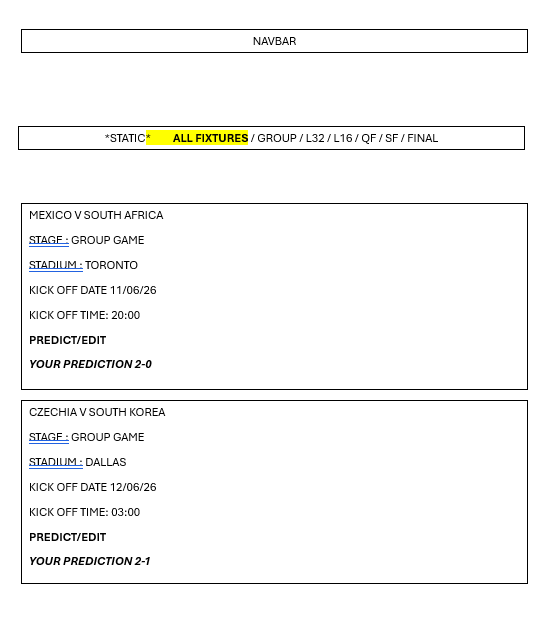

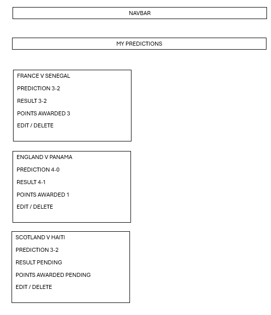

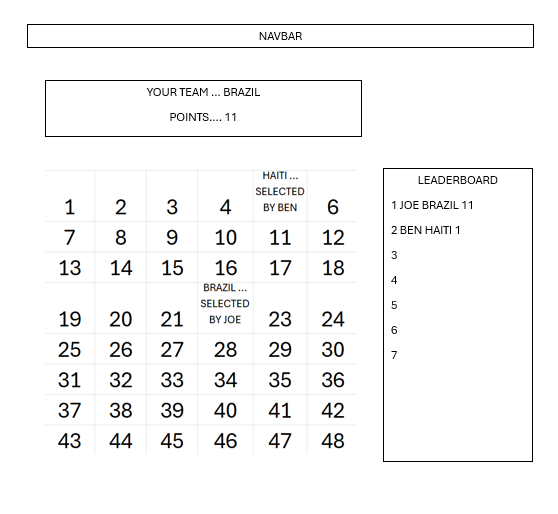

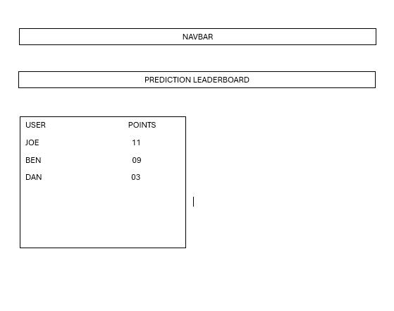
---

## Mobile Wireframe

*To be provided.*

---

# Features

## Home Page

The homepage introduces World Cup Hub 2026 and provides a clear overview of both the free Predictor game and the premium Pontoon competition. A custom World Cup hero image, vibrant colour scheme and clear call-to-action buttons help users navigate the platform.

---

## Authentication

User registration and authentication are handled using Django Allauth. Registered users can securely sign up, log in, log out and reset their password using an email-based password reset flow. Protected areas ensure only authenticated users can access game functionality.

---

## Predictor Game

Users can predict the score of every World Cup fixture before kick-off. Fixtures can be filtered by group matchday and knockout stage, making large numbers of matches easier to navigate. Predictions automatically lock once a fixture has started to ensure fair competition.

---

## Prediction Leaderboard

Prediction scores are calculated automatically after results are entered. Users earn points for correct outcomes and exact scorelines, with an automatically updated leaderboard displaying medal positions for the top three competitors.

---

## World Cup Pontoon

Pontoon is a premium competition inspired by a traditional pub game and adapted specifically for the FIFA World Cup. Users purchase access through Stripe, select one numbered football and are randomly assigned a World Cup nation. Teams score two points for every goal scored and lose one point for every goal conceded, with the aim of finishing as close to 21 points as possible without going bust.

---

## Pontoon Leaderboard

The Pontoon leaderboard displays each player's assigned nation, current score and status, clearly identifying active teams, busted teams and the current competition leader.

---

## Stripe Integration

Stripe Checkout provides secure online payments for premium Pontoon access. Following successful payment, users receive a dedicated confirmation page before entering the competition. Webhook verification has also been implemented and tested to support future payment reliability improvements.

---

## Responsive Design

The application has been designed using Bootstrap alongside custom CSS to provide a consistent experience across desktop, tablet and mobile devices. Additional responsive enhancements were introduced throughout development to improve usability on smaller screens.

---

# Future Improvements

Several ideas were identified throughout development that could further improve the platform:

- Complete webhook-driven payment handling so premium access can be granted even if users do not return from Stripe.
- Expand the existing team fact files with squad information, FIFA rankings and historical statistics.
- Display live scores and match statistics using a football data API.
- Add countdown timers for upcoming fixtures.
- Allow users to upload profile pictures and personalise their accounts.
- Introduce prediction achievements, badges and detailed player statistics.
- Support additional football competitions such as the Premier League, Championship and UEFA Champions League.
- Add administrator controls to create and manage multiple Pontoon competitions.
- Improve accessibility further through additional ARIA labels, keyboard navigation and enhanced colour contrast.
- Introduce optional dark mode.

---

# Database Design

World Cup Hub 2026 uses a relational PostgreSQL database to minimise data duplication, maintain data integrity and enforce the business rules of both the Predictor and Pontoon applications.

The database consists of five core models:

- Team
- Fixture
- Prediction
- PontoonBall
- PontoonAccess

Together these models manage tournament information, user predictions, Pontoon gameplay and premium access.

---

## Entity Relationship Diagram (ERD)

The Entity Relationship Diagram below illustrates the relationships between the application's core models.

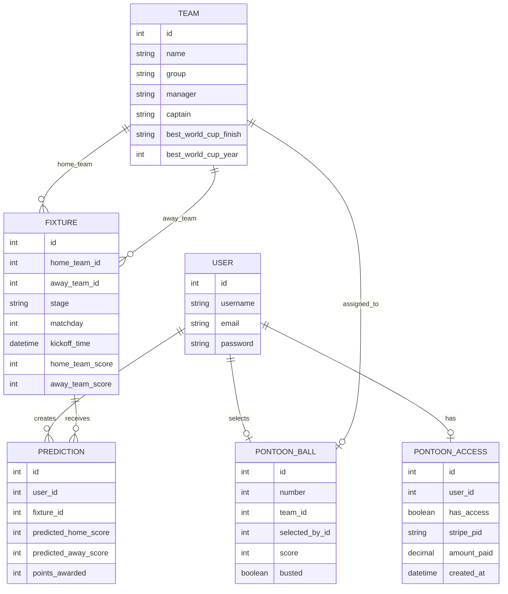
```mermaid
erDiagram
    USER ||--o{ PREDICTION : creates
    USER ||--o| PONTOON_ACCESS : has
    USER ||--o| PONTOON_BALL : selects

    TEAM ||--o{ FIXTURE : home_team
    TEAM ||--o{ FIXTURE : away_team
    TEAM ||--o| PONTOON_BALL : assigned_to

    FIXTURE ||--o{ PREDICTION : receives

    USER {
        int id
        string username
        string email
        string password
    }

    TEAM {
        int id
        string name
        string group
        string manager
        string captain
        string best_world_cup_finish
        int best_world_cup_year
    }

    FIXTURE {
        int id
        int home_team_id
        int away_team_id
        string stage
        int matchday
        datetime kickoff_time
        int home_team_score
        int away_team_score
    }

    PREDICTION {
        int id
        int user_id
        int fixture_id
        int predicted_home_score
        int predicted_away_score
        int points_awarded
    }

    PONTOON_BALL {
        int id
        int number
        int team_id
        int selected_by_id
        int score
        boolean busted
    }

    PONTOON_ACCESS {
        int id
        int user_id
        boolean has_access
        string stripe_pid
        decimal amount_paid
        datetime created_at
    }
```

The ERD shows how the application's models interact through one-to-many and one-to-one relationships. The `Prediction` model links users to fixtures, `PontoonBall` ensures each football and team can only be assigned once, and `PontoonAccess` manages premium access following successful Stripe payments.

---

## Team

Stores information about each qualified World Cup nation.

**Main fields**

- name
- group
- manager
- captain
- best_world_cup_finish
- best_world_cup_year

**Relationships**

- One Team can appear in many Fixtures.
- One Team can only be assigned to one PontoonBall.

---

## Fixture

Stores every World Cup fixture and its official result.

**Main fields**

- home_team
- away_team
- stage
- matchday
- kickoff_time
- home_team_score
- away_team_score

**Relationships**

- Each Fixture references one home Team and one away Team.
- One Fixture can receive many Predictions.

---

## Prediction

Stores a user's prediction for an individual fixture.

**Main fields**

- user
- fixture
- predicted_home_score
- predicted_away_score
- points_awarded

**Relationships**

- One User can create many Predictions.
- One Fixture can have many Predictions.

---

## PontoonBall

Represents a numbered football within the premium Pontoon competition.

**Main fields**

- number
- team
- selected_by
- score
- busted

**Relationships**

- One User can only select one PontoonBall.
- One Team can only be assigned to one PontoonBall.

These one-to-one relationships ensure every football and every nation can only be used once, maintaining fairness throughout the competition.

---

## PontoonAccess

Stores premium access information for users who purchase entry to the Pontoon competition.

**Main fields**

- user
- has_access
- stripe_pid
- amount_paid
- created_at

**Relationships**

- One User can have one PontoonAccess record.

This model manages premium access following successful Stripe payments.

---

# Technologies Used

## Programming Languages

- HTML5
- CSS3
- JavaScript
- Python

---

## Frameworks and Libraries

- Django
- Bootstrap 5
- Django Allauth
- Stripe
- Font Awesome
- Google Fonts

---

## Database

- SQLite (Development)
- PostgreSQL (Production)

---

## Deployment and Supporting Packages

- Heroku
- WhiteNoise
- dj-database-url
- Gunicorn
- Psycopg

---

## Development Tools

- Git
- GitHub
- Visual Studio Code
- Balsamiq (Wireframes)
- Google Chrome Developer Tools
- Stripe CLI

---

## External Resources

- **Flag Icons by Lipis** – National flag SVG icons used throughout the application.
- **Mermaid** – Used to generate the Entity Relationship Diagram (ERD) within this README.
- **Google Fonts** – Typography used throughout the application.
- **Font Awesome** – Icons used throughout the user interface.
- **FIFA** – Fixture information, tournament structure and participating nation data.

---

# Deployment

World Cup Hub 2026 was developed locally using Visual Studio Code before being deployed to Heroku with a PostgreSQL production database.

---

## Local Development

### Clone the Repository

```bash
git clone https://github.com/YOUR-USERNAME/world-cup-hub-2026.git
```

Navigate into the project directory:

```bash
cd world-cup-hub-2026
```

---

### Create a Virtual Environment

Create a virtual environment:

```bash
python -m venv .venv
```

Activate the environment.

Windows:

```bash
.venv\Scripts\activate
```

---

### Install Dependencies

Install all required packages:

```bash
pip install -r requirements.txt
```

---

### Environment Variables

Create an `env.py` file (or configure environment variables within your IDE) containing the required secrets.

The application requires the following variables:

```text
SECRET_KEY
DATABASE_URL
STRIPE_PUBLIC_KEY
STRIPE_SECRET_KEY
STRIPE_WH_SECRET
```

These values should never be committed to GitHub.

---

### Database Migrations

Apply the migrations:

```bash
python manage.py migrate
```

---

### Create a Superuser

```bash
python manage.py createsuperuser
```

---

### Run the Development Server

```bash
python manage.py runserver
```

The application will then be available at:

```
http://127.0.0.1:8000/
```

---

# Heroku Deployment

The application was deployed using Heroku with a PostgreSQL production database.

Deployment steps:

1. Create a Heroku application.
2. Attach a PostgreSQL database.
3. Configure the required Config Vars.
4. Connect the GitHub repository.
5. Enable automatic or manual deployments.
6. Deploy the main branch.
7. Run database migrations.
8. Create a production superuser.
9. Verify that static files load correctly.

---

## Required Heroku Config Vars

| Variable | Purpose |
|-----------|---------|
| SECRET_KEY | Django secret key |
| DATABASE_URL | PostgreSQL connection |
| STRIPE_PUBLIC_KEY | Stripe publishable key |
| STRIPE_SECRET_KEY | Stripe secret key |
| STRIPE_WH_SECRET | Stripe webhook signing secret |

---

## Static Files

Static files are served using WhiteNoise.

Before deployment:

```bash
python manage.py collectstatic
```

---

## Live Application

The deployed application is available at:

https://world-cup-hub-2026-861092c83eef.herokuapp.com

---

# Code Standards

The project was developed using consistent coding conventions to improve readability and maintainability.

- Python code follows **PEP 8** style guidelines where possible.
- Meaningful variable, function and model names have been used throughout.
- Views and models contain descriptive comments and docstrings where appropriate.
- HTML templates use consistent indentation and Django template syntax.
- Bootstrap utility classes were combined with custom CSS to maintain a consistent visual style.
- Git was used throughout development with small, logical commits documenting the project's progression.

---

# Improvements Implemented During Development

Although the project began with a defined set of user stories, several improvements were identified and implemented throughout development as testing progressed.

### Expanded Fixture Filtering

#### Original Plan

The original fixture page displayed all fixtures together on a single page.

#### Improvement Implemented

As the number of fixtures increased, navigation became more difficult. Matchday filtering was introduced to improve usability.

Users can now filter fixtures by:

- Matchday 1
- Matchday 2
- Matchday 3
- Round of 32
- Round of 16
- Quarter Finals
- Semi Finals
- Final

#### Benefit

This significantly improved navigation and reduced the amount of scrolling required to find fixtures.

---

### Persistent Fixture Filters

#### Original Behaviour

After saving predictions, users were returned to the default fixture page.

#### Improvement Implemented

The application now remembers the user's selected filter and returns them to the same matchday or knockout stage after saving predictions.

#### Benefit

This creates a smoother user experience when entering large numbers of predictions.

---

### Enhanced Payment Confirmation Experience

#### Original Behaviour

After completing a Stripe payment, users were immediately redirected to the Pontoon page with a standard success message.

#### Improvement Implemented

A dedicated payment confirmation page was introduced.

The page now:

- Confirms successful payment.
- Explains that Pontoon access has been unlocked.
- Provides a clear button to continue to the Pontoon game.
- Displays the Stripe payment reference.

#### Benefit

This provides reassurance that payment was successful and creates a more professional user experience.

---

### Improved Pontoon Selection Validation

#### Original Behaviour

Users who had already selected a football could still reach the confirmation screen before being prevented from selecting another team.

#### Improvement Implemented

Validation was moved earlier in the process so users are immediately informed if they have already selected a football.

#### Benefit

This removes unnecessary steps and provides clearer feedback.

---

### Leaderboard Medal System

#### Original Plan

Leaderboards displayed only numerical positions.

#### Improvement Implemented

Gold, Silver and Bronze medals were added for the top three positions.

#### Benefit

This improves visual appeal and makes leaderboard rankings easier to understand.

---

### Authentication Page Redesign

#### Original Behaviour

Login, registration and logout pages used standard Bootstrap card styling.

#### Improvement Implemented

Custom World Cup themed authentication panels were introduced using project branding, custom colours and Font Awesome icons.

#### Benefit

This created a more consistent visual identity throughout the application.

---

### Pontoon Score Visual Indicators

#### Original Behaviour

All positive scores used the same styling.

#### Improvement Implemented

Additional visual feedback was added:

- Gold styling for winning scores.
- Red styling for busted scores.
- Clear status indicators for Winner, Active and Busted teams.

#### Benefit

Users can understand game status more quickly without reading additional information.

### Mobile Hero Button Optimisation

#### Original Behaviour

During responsive testing, the two call-to-action buttons displayed on the homepage hero section were positioned side-by-side on all screen sizes.

Testing revealed that on smaller mobile devices (approximately 400px width and below), the buttons began to overlap, reducing usability and negatively affecting the user experience.

#### Improvement Implemented

A dedicated responsive breakpoint was introduced for smaller mobile devices. Below 420px screen width, the hero buttons automatically stack vertically rather than remaining side-by-side.

#### Benefit

This ensures that users on smaller mobile devices can clearly view and interact with both buttons without overlap or layout issues. The improvement increases accessibility, usability, and overall mobile responsiveness.

---

# Testing

## Relationship Testing

The relationships defined within the application's database models were manually tested using both the Django administration panel and the application interface to ensure data integrity and enforce the intended business rules.

| Relationship Tested | Expected Outcome | Result |
|---------------------|------------------|--------|
| One Team can appear in multiple Fixtures | Team records reused across fixtures | ✅ Pass |
| One Fixture can contain multiple Predictions | Multiple users can predict the same fixture | ✅ Pass |
| One User can create multiple Predictions | Users can predict every fixture | ✅ Pass |
| One User can only select one Pontoon football | Second selection prevented | ✅ Pass |
| One Team can only be assigned to one Pontoon football | Duplicate team assignments prevented | ✅ Pass |
| One User can only have one Pontoon access record | Duplicate access records prevented | ✅ Pass |
| Only users with Pontoon access can enter the game | Non-paying users redirected to checkout | ✅ Pass |

The relationship testing confirmed that all database relationships behaved as expected and successfully enforced the application's business rules.

## Manual Testing

### Authentication Testing

| Test | Expected Outcome | Result | Evidence |
|--------|-----------------|---------|---------|
| User can create an account | Account created successfully | Pass | signup.png |
| User can log in with valid credentials | User redirected to application | Pass | login.png |
| Invalid login details | Error displayed to user | Pass | login.png |
| Logged-out user attempts to access predictions | Redirected to login page | Pass | login.png |
| Logged-out user attempts to access Pontoon | Redirected to login page | Pass | login.png |
| User can log out successfully | Session terminated and user logged out | Pass | signout.png |
| Logout confirmation displayed | User prompted before logging out | Pass | signout-confirmation.png |
| User can request password reset | Reset email generated successfully | Pass | password-reset.png |
| User can access reset link | Password reset form displayed | Pass | password-reset-email.png |
| User can set new password | Password updated successfully | Pass | password-reset-complete.png |

#### Authentication Screenshots

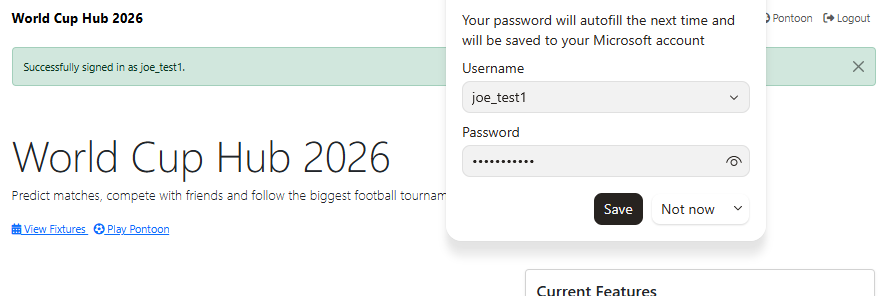

*Figure 1: User registration page.*

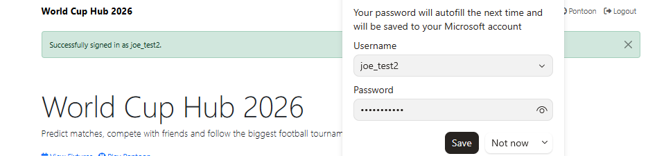

*Figure 2: User login page.*

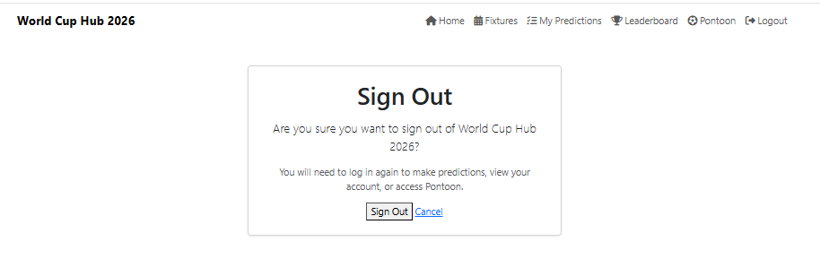

*Figure 3: Logout confirmation page.*

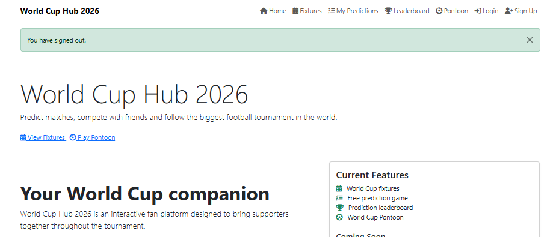

*Figure 4: Successful logout process.*

---

### Predictor Testing

| Test | Expected Outcome | Result | Evidence |
|--------|-----------------|---------|---------|
| View all fixtures | Fixtures display correctly | Pass | all-fixtures.png |
| Matchday 1 filter | Only Matchday 1 fixtures displayed | Pass | filtered-fixtures-1.png |
| Matchday 2 filter | Only Matchday 2 fixtures displayed | Pass | filtered-fixtures-2.png |
| Knockout stage filter | Only knockout fixtures displayed | Pass | filtered-fixtures-2.png |
| Save prediction | Prediction saved successfully | Pass | all-fixtures.png |
| Save multiple predictions | Multiple predictions saved successfully | Pass | all-fixtures.png |
| Fixture after kickoff | Prediction automatically locked | Pass | lock-after-kickoff.png |
| Locked fixture | User unable to edit prediction | Pass | lock-after-kickoff.png |
| Competitor predictions visible after kickoff | User can view competitor predictions | Pass | load-competitors-fixtures.png |
| Exact score prediction | 3 points awarded | Pass | predictions-after-two-games.png |
| Correct result prediction | 1 point awarded | Pass | predictions-after-two-games.png |
| Prediction leaderboard updates automatically | Scores recalculated correctly | Pass | predictions-after-two-games.png |
| Gold, Silver and Bronze medals displayed | Top three users awarded medals | Pass | predictions-after-two-games.png |

#### Predictor Test Scenario

After two completed fixtures:

- **joeb** correctly predicted two exact scores and received **6 points**.
- **joe_test1** correctly predicted two match results and received **2 points**.
- **joe_test2** and **joe_test3** received **0 points**.

The leaderboard automatically recalculated and displayed the correct rankings.

#### Predictor Screenshots

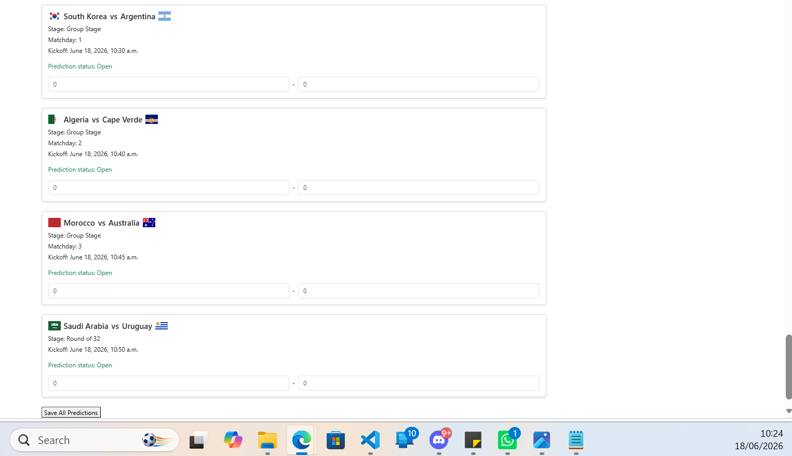

*Figure 5: Fixture page displaying available fixtures and prediction inputs.*

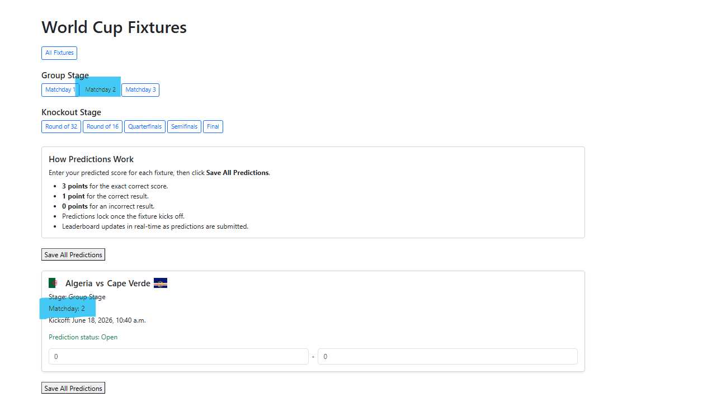

*Figure 6: Matchday filtering displaying selected fixtures only.*

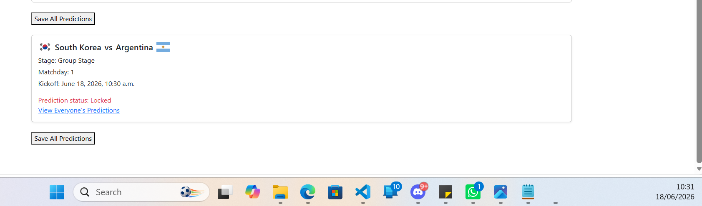

*Figure 7: Locked fixture preventing further prediction changes.*

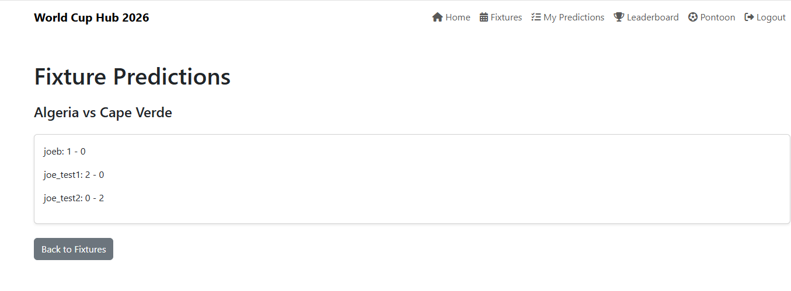

*Figure 8: Competitor predictions visible after kickoff.*

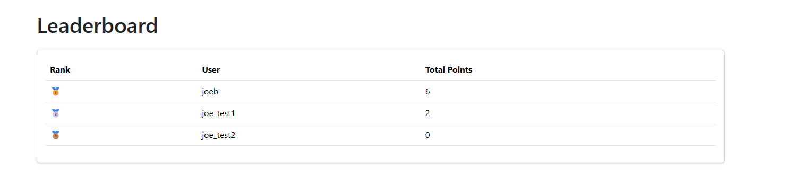

*Figure 9: Prediction leaderboard showing automatic scoring and medal rankings.*

---

### Pontoon Testing

| Test | Expected Outcome | Result | Evidence |
|--------|-----------------|---------|---------|
| User accesses Pontoon before selecting a football | Available footballs displayed | Pass | pre-ball-select.png |
| User selects a football | Confirmation page displayed | Pass | pre-ball-select.png |
| User confirms football selection | Football assigned successfully | Pass | post-ball-select.png |
| User attempts to select a second football | Selection prevented | Pass | unable-to-select-second-team.png |
| Assigned team displayed correctly | User's nation and flag shown correctly | Pass | post-ball-select.png |
| Pontoon leaderboard displays participants | Users and scores displayed correctly | Pass | pontoon-after-2-games.png |
| Goals scored increase Pontoon score | Score updates automatically | Pass | pontoon-after-2-games.png |
| Goals conceded reduce Pontoon score | Score updates automatically | Pass | pontoon-after-2-games.png |
| Team reaches exactly 21 points | Winner status awarded | Pass | pontoon-complete.png |
| Team exceeds 21 points | Busted status awarded | Pass | pontoon-complete.png |
| One football per user restriction | Duplicate selection prevented | Pass | unable-to-select-second-team.png |

#### Pontoon Test Scenario

Following multiple completed fixtures:

**Australia**

- Won 2–0
- Won 4–0
- Won 4–0
- Reached exactly **21 points**
- Automatically awarded **Winner** status.

**Morocco**

- Won 4–0
- Won 3–1
- Won 4–0
- Reached **22 points**
- Automatically marked as **Busted**.

The Pontoon leaderboard updated automatically based on goals scored and goals conceded.

#### Pontoon Screenshots

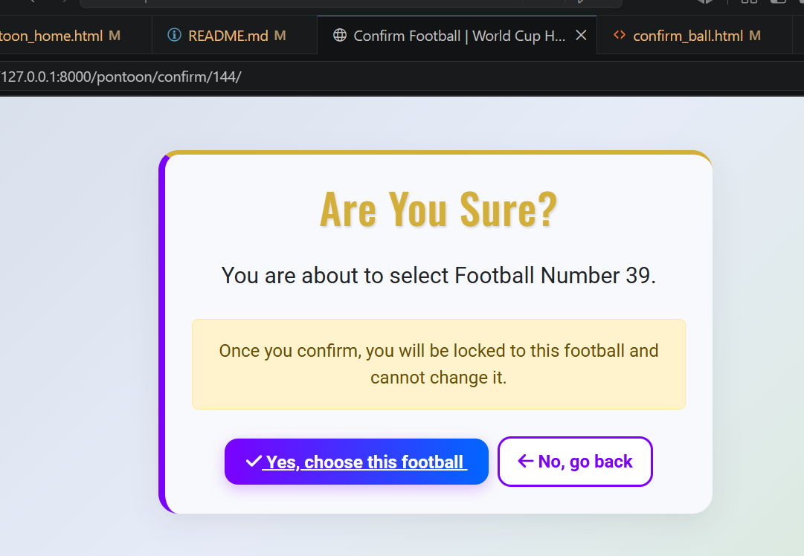

*Figure 10: Available footballs before a selection has been made.*

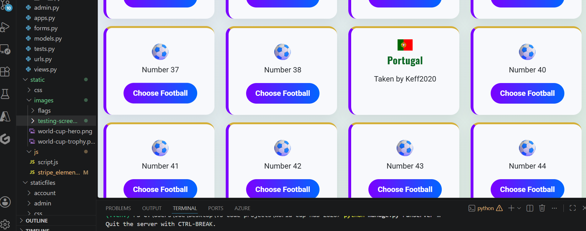

*Figure 11: Successful football selection and team assignment.*

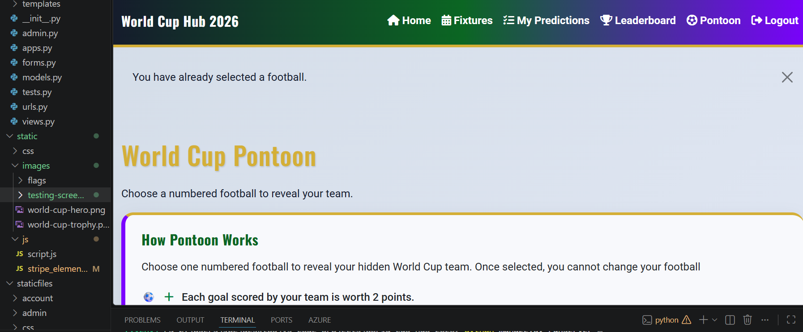

*Figure 12: Validation preventing duplicate football selection.*

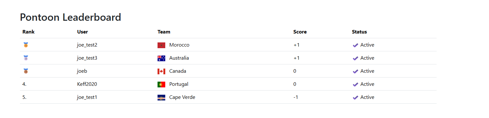

*Figure 13: Pontoon leaderboard after completed fixtures.*

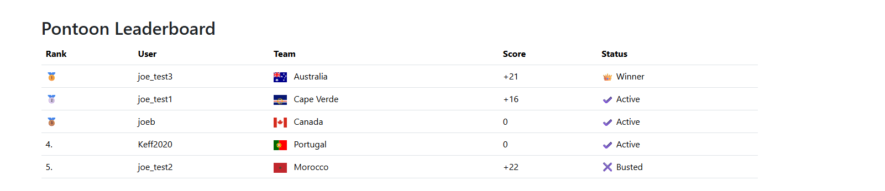

*Figure 14: Winner and Busted status applied correctly.*

---

### Stripe Payment Testing

| Test | Expected Outcome | Result | Evidence |
|--------|-----------------|---------|---------|
| User without Pontoon access | Redirected to payment page | Pass | pre-payment.png |
| Stripe checkout page loads | Card form displayed correctly | Pass | pre-payment.png |
| Stripe test card accepted | Payment processed successfully | Pass | post-payment.png |
| Successful payment | User redirected to confirmation page | Pass | post-payment.png |
| Pontoon access granted | User gains access successfully | Pass | post-payment.png |
| Existing Pontoon users retain access | Existing users continue to access Pontoon | Pass | post-payment.png |

#### Stripe Screenshots

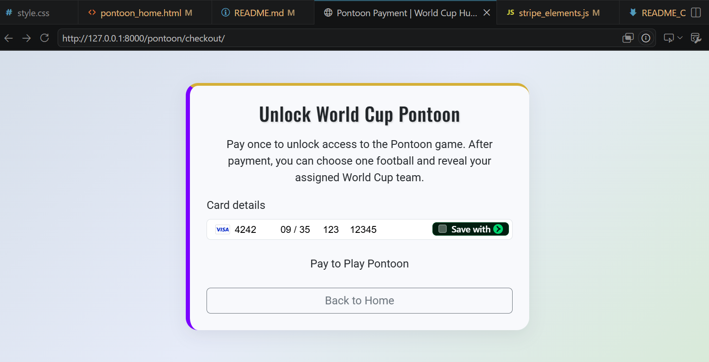

*Figure 15: Stripe checkout page before payment submission.*

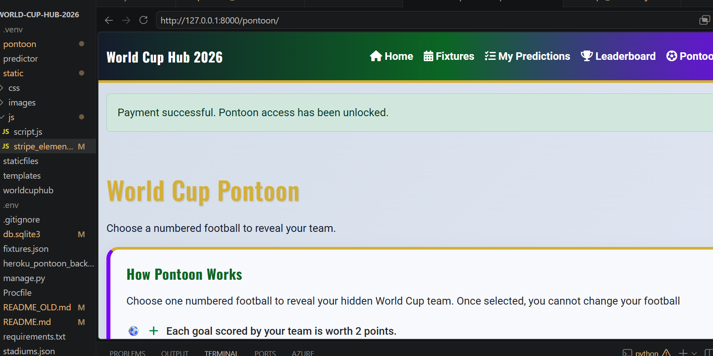

*Figure 16: Successful Stripe payment confirmation and Pontoon access granted.*

---

## Responsive Testing

| Device | Result |
|----------|---------|
| Desktop | Layout displayed correctly |
| Tablet | Layout adjusted correctly |
| Mobile | Content remained readable and responsive |

### Mobile Responsive Layout

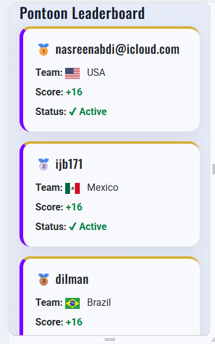

*Figure 17: Mobile layout demonstrating responsive navigation, Pontoon game cards and the mobile-friendly Pontoon leaderboard.*

---

## Browser Compatibility Testing

| Browser | Result |
|----------|---------|
| Google Chrome | Pass |
| Microsoft Edge | Pass |
| Mozilla Firefox | Pass |

## Validation Testing

### HTML Validation

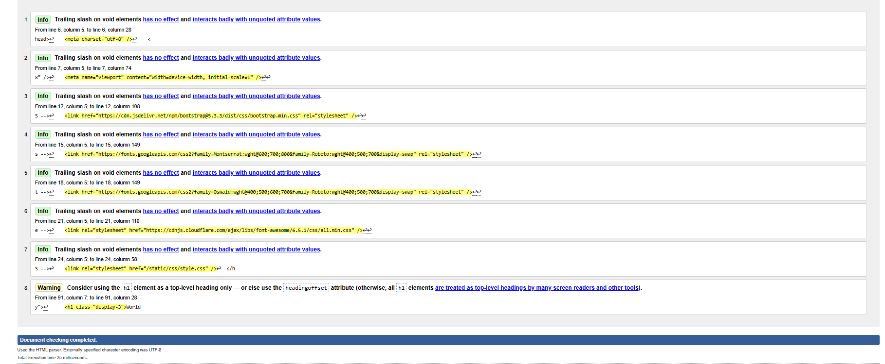

*Figure 11: W3C HTML validation results.*

### CSS Validation

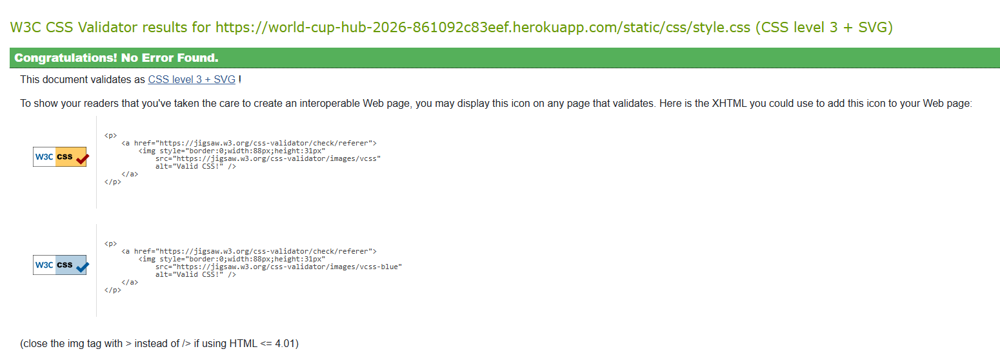

*Figure 12: W3C CSS validation results.*

### JavaScript Validation

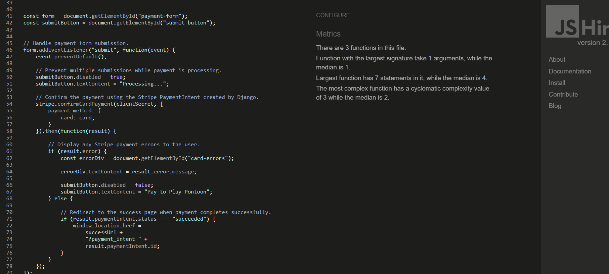

*Figure 13: JavaScript validation results.*

### Python Validation

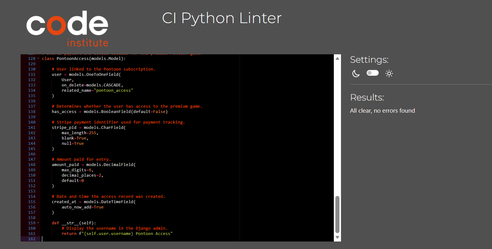

*Figure 14: Python validation results.*

---

## Lighthouse Testing

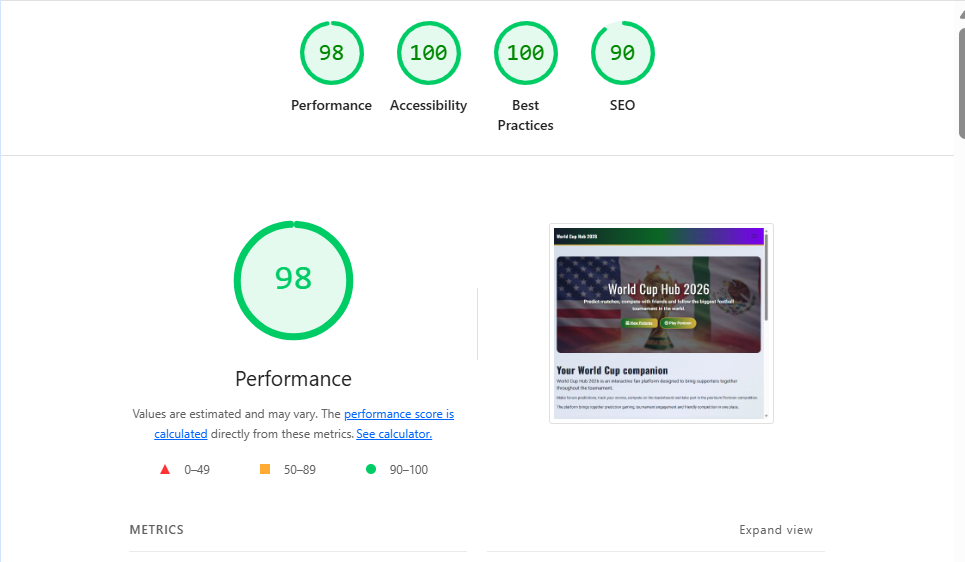

*Figure 15: Lighthouse performance, accessibility, best practices and SEO results.*

## Production Deployment Testing

The application was deployed to Heroku using a PostgreSQL production database. Additional testing was carried out to ensure that functionality worked correctly in both the local development environment and the deployed production environment.

| Test | Expected Outcome | Result |
|--------|-----------------|---------|
| Heroku application deployment | Application deployed successfully | Pass |
| PostgreSQL database connection | Application connected successfully to production database | Pass |
| User registration in production | New users can create accounts | Pass |
| User login in production | Existing users can log in successfully | Pass |
| Fixture data available in production | Fixtures display correctly from PostgreSQL database | Pass |
| Team data available in production | Teams display correctly throughout the application | Pass |
| Pontoon footballs available in production | Footballs display correctly and remain selectable | Pass |
| Existing Pontoon selections retained | Existing users retain assigned footballs and teams | Pass |
| Stripe configuration variables | Stripe checkout loads without configuration errors | Pass |
| Stripe payment processing | Test payments complete successfully | Pass |
| Pontoon access granted after payment | Premium access unlocks correctly after successful payment | Pass |
| Prediction submissions in production | Predictions save successfully to PostgreSQL database | Pass |
| Leaderboard calculations in production | Scores update correctly after fixture results are entered | Pass |
| Prediction locking after kickoff | Fixtures lock automatically once kickoff time has passed | Pass |
| Matchday filtering | Fixtures filter correctly by Matchday 1, 2 and 3 | Pass |
| Knockout stage filtering | Fixtures filter correctly by competition stage | Pass |

### Stripe Payment Testing

Stripe Checkout was implemented to provide paid access to the World Cup Pontoon game.

Testing included:

- Successful payments using Stripe test cards.
- Redirect to the custom payment success page.
- Creation of a `PontoonAccess` record after payment.
- Prevention of unauthorised users accessing the Pontoon game.
- Stripe CLI webhook testing using `stripe listen` and `stripe trigger`.
- Verification that webhook events such as `payment_intent.created`, `payment_intent.succeeded`, `charge.succeeded` and `charge.updated` were successfully received.

The application currently grants Pontoon access through the payment success view after Stripe redirects the user back to the application. Webhook verification has been implemented and tested, with full webhook-driven database updates identified as a future enhancement.

---

### Deployment Challenges Encountered

During deployment several issues were identified and resolved:

- PostgreSQL migration initially resulted in missing production data after switching from SQLite.
- Team, fixture and Pontoon data were re-imported into the production database.
- Existing Pontoon selections required testing after database changes to ensure users retained access.
- Stripe environment variables required configuration through Heroku Config Vars.
- Fixture kickoff times displayed incorrectly after timezone configuration changes.
- Extensive testing was performed using the Heroku shell to compare stored UTC values against displayed UK times.
- Prediction locking behaviour was validated in production to ensure fixtures locked automatically after kickoff.

### Production Deployment Screenshots

#### Heroku Application


*Figure 16: World Cup Hub 2026 successfully deployed on Heroku.*

#### PostgreSQL Database


*Figure 17: Production PostgreSQL database connected successfully.*

#### Production Fixture Locking


*Figure 18: Fixture automatically locked after kickoff in production environment.*

#### Production Stripe Payment

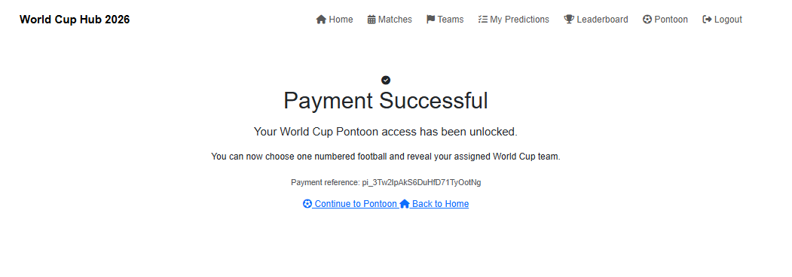

*Figure 19: Stripe payment system operating successfully in production.*

---

# Challenges Faced & Solutions

## Initial Database Setup

### Challenge

When attempting to create a Django superuser, an error appeared stating that the `auth_user` table did not exist.

### Solution

The issue was resolved by running:

```bash
python manage.py migrate
```

This created the required Django authentication tables and allowed the superuser account to be created successfully.

### Learning Outcome

This reinforced the importance of running migrations before attempting to use Django models and built-in authentication functionality.

---

## Importing Team Data

### Challenge

The World Cup team data was originally stored in JSON format and could not be imported directly using Django's `loaddata` command.

### Solution

A custom Django shell script was used to create and update team records from the JSON data rather than manually entering all teams through Django Admin.

### Learning Outcome

This demonstrated how custom scripts can simplify large data imports while reducing manual entry errors.

---

## Prediction Authentication Error

### Challenge

During testing, an anonymous user attempted to save a prediction, causing an error because predictions require an authenticated user.

### Solution

The prediction views were protected using Django's built-in authentication decorators.

```python
@login_required
```

### Learning Outcome

This reinforced the importance of securing user-generated content and protecting functionality that requires authentication.

---

## Duplicate Prediction Submission

### Challenge

Submitting a second prediction for the same fixture generated a database integrity error.

### Solution

The prediction logic was updated to use `get_or_create()` so that existing predictions could be updated rather than duplicated.

### Learning Outcome

This demonstrated the importance of enforcing database integrity while maintaining a positive user experience.

---

## Pontoon Team Randomisation

### Challenge

Pontoon footballs were originally assigned alphabetically, making team assignments predictable.

### Solution

Python's built-in randomisation functions were used to shuffle teams before footballs were generated.

```python
import random

teams = list(Team.objects.all())
random.shuffle(teams)
```

### Learning Outcome

This improved fairness and demonstrated how simple Python tools can improve user experience.

---

## PostgreSQL Production Migration

### Challenge

After migrating from SQLite to PostgreSQL on Heroku, the production database contained no fixtures, teams or Pontoon data.

### Solution

The production database was repopulated by importing team, fixture and Pontoon data and validating relationships between models.

The following tasks were completed:

- Restored all 48 World Cup teams.
- Recreated all 48 Pontoon footballs.
- Reloaded World Cup fixture data.
- Verified foreign key relationships.
- Confirmed existing user selections remained intact.

### Learning Outcome

This highlighted the importance of understanding the difference between development and production databases.

---

## Stripe Configuration on Heroku

### Challenge

Stripe payments worked correctly in development but failed on the live Heroku deployment with the error:

```text
No API key provided
```

### Solution

The required Stripe Config Vars were added to Heroku:

```text
STRIPE_PUBLIC_KEY
STRIPE_SECRET_KEY
STRIPE_PONTOON_PRICE
```

After deployment, Stripe Elements loaded correctly and payments could be processed successfully.

### Learning Outcome

This reinforced the importance of environment variables and secure production configuration.

---

## Existing User Migration After Payment Integration

### Challenge

After introducing Stripe payments, existing Pontoon players risked losing access because they had no `PontoonAccess` records.

### Solution

A migration script was executed through the Heroku shell to create access records for existing participants.

```python
for ball in PontoonBall.objects.filter(selected_by__isnull=False):
    PontoonAccess.objects.get_or_create(
        user=ball.selected_by,
        defaults={
            "has_access": True,
            "stripe_pid": "manual-free-entry",
            "amount_paid": 0
        }
    )
```

### Learning Outcome

This demonstrated the importance of considering existing users whenever authentication, permission or payment systems are introduced.

---

## Matchday Filtering System

### Challenge

As more fixtures were added to the project, displaying every match on a single page became difficult for users to navigate.

### Solution

A matchday filtering system was introduced using Django URL parameters and queryset filtering.

Users can now view:

- Matchday 1
- Matchday 2
- Matchday 3
- Round of 32
- Round of 16
- Quarter Finals
- Semi Finals
- Third/Fourth play off
- Final

### Learning Outcome

This demonstrated how Django views and querysets can improve navigation and usability.

---

## Timezone and Prediction Locking Issues

### Challenge

Prediction locking behaved inconsistently between local development and the live Heroku deployment.

Fixtures sometimes remained editable after kickoff or appeared to lock at incorrect times.

### Cause

The issue was caused by timezone differences between Django, Heroku and stored fixture data.

The application initially relied on UTC while users expected fixture times to display in UK time.

### Solution

The timezone configuration was standardised using:

```python
TIME_ZONE = "Europe/London"
USE_TZ = True
```

The prediction locking helper method was then refined:

```python
def predictions_locked(self):
    lock_time = self.kickoff_time + timedelta(minutes=1)
    return timezone.now() >= lock_time
```

Fixture times were validated through Django Admin and the Heroku shell to ensure consistency between stored values and displayed values.

### Learning Outcome

This reinforced the importance of timezone-aware datetimes and production testing when implementing time-sensitive functionality.

---

## User Interface Redesign

### Challenge

The initial interface was functional but lacked a strong football identity and did not fully reflect the World Cup theme.

### Solution

The application was redesigned using:

- Custom CSS variables
- Google Fonts
- Font Awesome icons
- National flags
- Custom buttons and cards
- Responsive layouts
- A World Cup hero image
- Gold, green and purple branding

### Learning Outcome

This demonstrated how visual design choices can significantly improve usability and user engagement.

---

## Duplicate Template Block Error

### Challenge

While updating the fixtures page, Django returned the error:

```text
'block' tag with name 'title' appears more than once
```

### Cause

The template content had accidentally been duplicated, resulting in multiple:

```django

```

and

```django

```

sections within the same file.

### Solution

The duplicated code was removed so that only one title block and one content block remained.

### Learning Outcome

This reinforced the importance of carefully reviewing templates when merging large sections of code.

---

## README Wireframe Images

### Challenge

After adding wireframe images to the README, GitHub displayed broken image icons instead of the images, despite the Markdown paths appearing to be correct.

### Cause

The wireframe images were referenced using the correct Markdown paths, however the PNG files had been saved in `static/images/` instead of the intended `static/images/wireframes/` directory. As a result, GitHub could not locate the files and displayed broken image links in the README.

### Solution

The image file locations were verified using the terminal. After confirming that the `wireframes` folder was empty, the PNG files were moved into the correct directory:

```text
static/images/wireframes/
```

Using **Reveal in File Explorer** within VS Code helped confirm the actual file locations before committing the changes to GitHub.

### Learning Outcome

This reinforced the importance of verifying the physical location of files rather than relying solely on the VS Code Explorer. It also highlighted how GitHub resolves relative file paths in Markdown and demonstrated the value of using terminal commands such as `dir` and `git ls-files` to diagnose file path issues.
